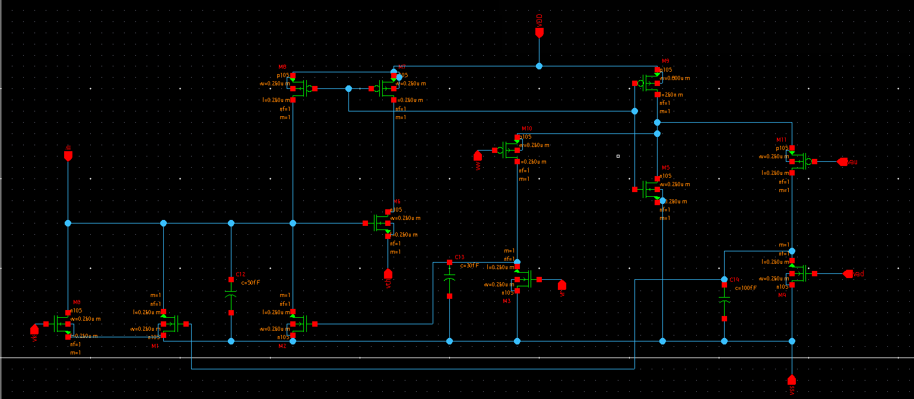
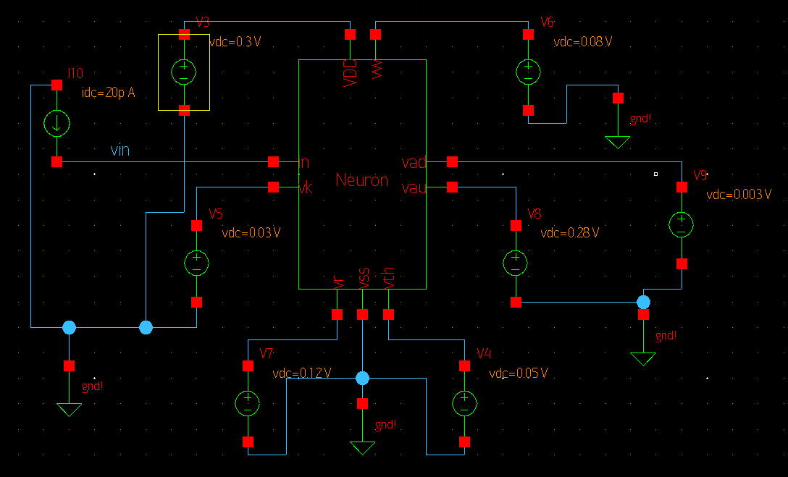
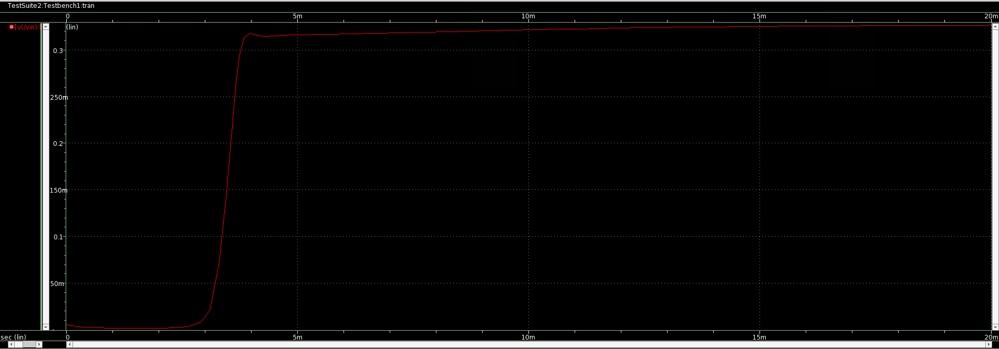

# Low Power Compact Analog Spiking Neuron

This repository presents the design of Low Power Compact Analog Spiking Neuron implemented using Synopsis Custom Compiler on 28nm CMOS Technology.

# Table of Contents
 * [Introduction](#Introduction)
 * [Explanation](#Explanation)
 * [Tools Used](#Tools-Used)
 * [Pre-Layout Schematics and Simulations](#Pre-Layout-Schematics-and-Simulations)
 * [Netlist of the Circuit](#Netlist-of-the-Circuit)
 * [Observations](#Observations)
 * [Author](#Author)
 * [Acknowledgements](#Acknowledgements)
 * [References](#References)

# Introduction:

In VLSI System Design, Phase Locked Loop (PLL) is an essential building block for many timing generator applications. It comprises of five essential blocks which are Phase Frequency detector, Charge Pump, Low pass filter, Voltage controlled oscillator and Frequency Divider. Among many different oscillators, LC and ring oscillators are the most commonly used ones. The LC VCO occupies more area, and the tuning range is very narrow. Ring VCO provides a wide tuning range, less power consumption with less area. Among many types of Ring oscillators, Current starved VCO offers a balance between the power, area, phase noise with wide tuning range. In PLL, VCO is the most sensitive block to leakage power, and it will affect the performance of PLL to a more considerable extent.The scope of this work is to present a low power Current Starved Voltage Controlled Oscillator with Differential cross-coupled inverters as delay stages instead of regular inverters. Couple of benefits of using this Differential Cross coupled inverter is that: one, leakage power can be reduced thereby reducing overall power consumption and two, phase noise is reduced making this circuit stable; Hence can be used in space applications such as Radiation hardening of PLL.

# Explanation

The Reference circuit basically implements the spiking behavior in neurons. The Input current Iin in acts as an excitatory current to the neuron. The leak Transistor Mk represents the leakage current in the neuron and can be adjusted by Vk. The Net excitatory current charges up the membrane capacitor Cv. The voltage v acts as a gate voltage for M1. When it increases beyond the threshold voltage of M1, Current Flows through it and is mirrored by the current mirror M2-M3 , which acts as a positive feedback. This drops the Vf voltage which connects to an inverter. The inverter emulates an axon of a neuron and creates a spike. When the spike occurs capacitor Cu is charged by M6 and simultaneously a portion of the current is taken by M6 . Here voltages Vw and voltage Vr are adjusted to set the spike width and refractory period of the neuron. A similar circuit with M9 , M10 and M11 have voltages Vad and Vau that are adjusted to set the adaptation and busting of the neuron. These neurons can be used to make intelligent systems such as artificial cochlea, retina and spiking neural networks. These neurons all operate in subthreshold regions to maximize power efficiency.

# Tools Used:

<b>• Synopsys Custom Compiler:</b> 
&emsp;The Synopsys Custom Compiler™ design environment is a modern solution for full-custom analog, custom digital, and mixed-signal IC design. As the heart of the Synopsys Custom Design Platform, Custom Compiler provides design entry, simulation management and analysis, and custom layout editing features. This tool was used to design the circuit on a transistor level.

<b>• Synopsys Primewave:</b> 
&emsp;PrimeWave™ Design Environment is a comprehensive and flexible environment for simulation setup and analysis of analog, RF, mixed-signal design, custom-digital and memory designs within the Synopsys Custom Design Platform. This tool helped in various types of simulations of the above designed circuit.

<b>• Synopsys 28nm PDK:</b> 
&emsp;The Synopsys 28nm Process Design Kit(PDK) was used in creation and simulation of the above designed circuit.

# Pre-Layout Schematics and Simulations:

## Schematics:

### Neuron :
Initially Schematic of the Neuron was implemented and converted into a symbol.

   
  Fig. 1: Neuron Schematic

   
  Fig. 2: Neuron Symbol

### Neuron Testbench:
A testbench was designed for testing the neuron.

   
  Fig. 3: Testbench Schematic

## Simulations:
### Transient Analysis:
After creating and saving the schematic go to 'Tools' and open 'Primewave' to start the simulation. In the Primewave select the 'model file' i.e the '28nm PDK's .lib file presentin the HSPICE folder. After this select the 'tran' analysis in the analysis window and give the 'Start', 'Stop', and 'Step Size' parameters and save it. Then add the outputs which needs to be plotted by selecting the nets on the schematic. 
One other thing we need to keep in mind is that here we have loop for which an initial condition needs to be declared. For that, we have to go to 'Setup -> Convergance aids' and select the net for which we want to set an initial condition.Then go to 'Simulations -> Netlist and Run' to generate a netlist and run the simulation to get the below output.

   
  Fig. 5: Neuron Transient Analysis

# Netlist of the Circuit:

Refer to the netlist of the Neuron here: <a href='Neuron_netlist.cir.out'>Netlist</a>

Refer to the netlist of the Neuron testbench here: <a href='netlist.cir.out'>Netlist</a>

# Observations:
• The required spiking behaviour was obtained.
• The supply voltage and consequently other voltages had to be adjusted from the reference design due to the change from 130nm to 28nm process.

# Author:
• Karthikeyan R, Electronics and Communication Engineering(B.E.), College of Engineering Guindy, Anna University, Chennai-600025.

# Acknowledgements:
• <a href='https://www.iith.ac.in/events/2022/02/15/Cloud-Based-Analog-IC-Design-Hackathon/'>Cloud Based Analog IC Design Hackathon</a> 
• <a href='https://www.synopsys.com/'>Synopsys India</a> 
• <a href='https://www.vlsisystemdesign.com/'>VLSI System Design (VSD) Corp. Pvt. Ltd India</a> 

# References:
[1] M. M. Hasan and J. Holleman, "Low Power Compact Analog Spiking Neuron Circuit Using Exponential Positive Feedback With Adaptation and Bursting Capability," 2020 IEEE 63rd International Midwest Symposium on Circuits and Systems (MWSCAS), 2020, pp. 452-455, doi: 10.1109/MWSCAS48704.2020.9184447.
